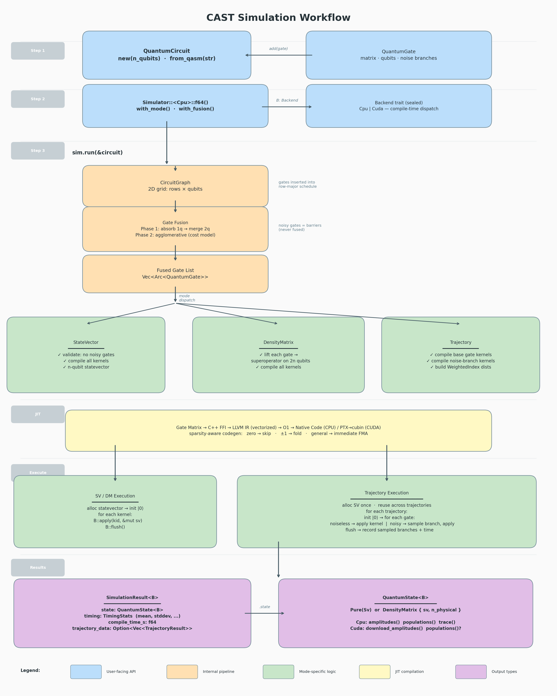

# Simulation Workflow

This document describes how a quantum circuit simulation proceeds in CAST,
from circuit construction through kernel execution to result extraction.

## Overview



CAST separates three concerns that were historically tangled together:

1. **Circuit** — a `QuantumCircuit` / `CircuitGraph` holds the gates.
2. **Optimization** — `fusion::optimize` rewrites the graph. Invoked by the
   *caller*, not the simulator.
3. **Execution** — `Simulator<B>` owns backend state (kernel manager, spec,
   thread count) and provides three per-run methods:
   [`simulate`](../src/simulator/mod.rs), [`sample_trajectory`](../src/simulator/trajectory.rs),
   and [`bench`](../src/simulator/bench.rs).

One simulator can handle many runs; the kernel cache persists across calls,
so duplicate gates across runs are deduplicated.

## Step 1: Build a Circuit

### Programmatic construction

```rust
use cast::types::{QuantumCircuit, QuantumGate};

let mut circuit = QuantumCircuit::new(4);  // 4 qubits
circuit.add(QuantumGate::h(0));
circuit.add(QuantumGate::cx(0, 1));
circuit.add(QuantumGate::depolarizing(0, 0.01));  // noisy gate
circuit.measure(&[0, 1]);  // used by eliminate_dead_gates below
```

`QuantumCircuit` stores `Vec<Arc<QuantumGate>>`, a qubit count, and a
`measured_qubits` list. `measure()` records which qubits the caller plans to
measure; it is consumed by `eliminate_dead_gates` and nothing else (the
simulator does not read it).

`eliminate_dead_gates()` returns a pruned copy of the circuit, removing gates
that cannot influence any measured qubit via backward liveness analysis.
Recommended for trajectory simulation of large circuits with sparse
measurements.

### From OpenQASM

```rust
let circuit = QuantumCircuit::from_qasm(
    "OPENQASM 2.0; qreg q[4]; h q[0]; cx q[0],q[1];"
)?;
```

Each parsed `openqasm::Gate` is converted to a `QuantumGate` (matrix + qubit
indices).

### Gate representation

Each `QuantumGate` carries:

```rust
struct QuantumGate {
    matrix: ComplexSquareMatrix,  // 2^k × 2^k unitary
    qubits: Vec<u32>,            // target qubits, sorted ascending
    noise: Vec<(f64, ComplexSquareMatrix)>,  // noise branches (empty = noiseless)
}
```

Noise branches `[(p_i, U_i)]` represent a probability-weighted unitary
channel. Probabilities sum to 1.0.

## Step 2: Build a CircuitGraph (and optionally fuse)

The simulator never touches `QuantumCircuit` directly. Callers convert to a
`CircuitGraph` — a 2D grid of rows × qubits that represents the circuit
schedule — and then optionally apply fusion as a separate, visible step:

```rust
use cast::CircuitGraph;
use cast::fusion;
use cast::cost_model::FusionConfig;

let mut graph = CircuitGraph::from_circuit(&circuit);

// Optional: apply a fusion strategy.
fusion::optimize(&mut graph, &FusionConfig::size_only(3));
```

`fusion::optimize` runs two phases:

1. **Phase 1 — Size-2 canonicalization**: absorb 1-qubit gates into adjacent
   multi-qubit gates; merge adjacent 2-qubit gates on the same wires.
2. **Phase 2 — Agglomerative fusion**: iteratively merge gates across rows up
   to a size limit, accepting only fusions where the cost model predicts a
   benefit.

Noisy gates act as fusion barriers — they are never merged.

Keeping fusion outside the simulator means the caller sees exactly what
transformations are applied, and the same fused graph can be reused across
multiple simulator methods.

## Step 3: Create a Simulator

```rust
use cast::simulator::{Simulator, Cpu, Cuda};

// CPU, F64 precision
let sim_cpu = Simulator::<Cpu>::f64();

// CPU, F32 precision with 16 worker threads
let sim_cpu32 = Simulator::<Cpu>::f32().with_threads(16);

// CUDA, F64
let sim_cuda = Simulator::<Cuda>::f64();
```

`Simulator<B>` is generic over a sealed `Backend` trait. `B` determines:

| | `Cpu` | `Cuda` |
|--|-------|--------|
| Statevector | `CPUStatevector` (SIMD-aligned, split re/im) | `CudaStatevector` (GPU device memory, interleaved) |
| Kernel manager | `CpuKernelManager` (LLVM OrcJIT, batched) | `CudaKernelManager` (LLVM → PTX → cubin) |
| Spec | `CPUKernelGenSpec` (precision, SIMD width, tolerances) | `CudaKernelGenSpec` (precision, tolerances, SM version) |
| Apply semantics | Synchronous (threaded dispatch) | Asynchronous (enqueue + `sync()`) |
| Exec timing | Wall-clock per iter | Summed CUDA event times |

The `Backend` trait is an implementation detail of `Simulator` — every method
is `#[doc(hidden)]`. User code only interacts with the three per-run methods
on `Simulator<B>`.

## Step 4: Run

`Simulator<B>` has three per-run methods, each returning a distinct result
type. Pick the one that matches your need.

### 4a. `simulate` — return a state

```rust
use cast::simulator::Representation;

let state = sim_cpu.simulate(&graph, Representation::StateVector)?;
let pops = state.populations();
```

For `Representation::StateVector`, every gate must be unitary. For
`Representation::DensityMatrix`, gates are lifted to superoperators acting on
a 2n-qubit virtual statevector (so noisy gates are supported):

```rust
let state = sim_cpu.simulate(&graph, Representation::DensityMatrix)?;
assert!((state.trace() - 1.0).abs() < 1e-10);
```

Internally: compile all kernels (with `finalize_compile` on CPU), allocate a
statevector, initialize to |0⟩, apply all kernels in order, sync, and return
the state.

### 4b. `sample_trajectory` — return a measurement histogram

```rust
use cast::simulator::TrajectoryOpts;

let opts = TrajectoryOpts {
    measured_qubits: vec![0, 1],
    n_samples: 10_000,
    seed: Some(42),
    max_ensemble: Some(4),
};
let traj = sim_cpu.sample_trajectory(&graph, &opts)?;

println!("explored weight: {:.4}", traj.explored_weight);
for (outcome, &count) in &traj.histogram {
    println!("  |{outcome:b}⟩ → {count}");
}
```

Trajectory mode ensemble-branches through noise paths (pruning to the top
`max_ensemble` highest-weight continuations at each noisy gate), then samples
measurement outcomes across surviving branches proportionally to weight.

For large circuits with sparse measurements, apply
`circuit.eliminate_dead_gates()` to the source `QuantumCircuit` before
building the graph — this removes gates that cannot affect the measured
qubits.

### 4c. `bench` — return timing samples

```rust
let timings = sim_cpu.bench(&graph, Representation::StateVector, 5.0)?;
println!(
    "compile {:.3}s, exec {:.3}ms ± {:.3}ms ({} iters)",
    timings.compile.mean_s(),
    timings.exec.mean_s() * 1e3,
    timings.exec.stddev_s() * 1e3,
    timings.exec.n(),
);
```

`bench` compiles once, then adaptively re-runs the apply loop within the
`exec_budget_s` wall-time budget. Returns raw per-iter samples. CPU samples
are wall-clock (`Instant::now`); CUDA samples are summed CUDA event times
(excluding host launch overhead).

Trajectory simulation is not benchmarked — its cost profile is dominated by
per-sample work that isn't usefully repeated in a loop.

## Kernel compilation

Each gate's matrix is compiled to a native kernel via the LLVM JIT pipeline:

**CPU path:**
```
QuantumGate.matrix → C++ FFI → LLVM IR (vectorized, SIMD) → O1 → OrcJIT batch → native function pointer
```

**CUDA path:**
```
QuantumGate.matrix → C++ FFI → LLVM IR → O1 → NVPTX PTX → cubin (driver JIT)
```

The kernel generator classifies each matrix entry:

- **Zero** (|entry| < ztol): skip entirely — no multiply, no memory access.
- **±1** (|1 − |entry|| < otol): fold into sign flip — no multiply.
- **General**: bake as immediate constant — one FMA.

This sparsity-aware codegen is the key to CAST's performance. `ztol` and
`otol` are fields on the kernel-gen spec; toggling them requires building a
new `Simulator` with a modified spec (the `bench` CLI does this via its
`--force-dense` flag).

On CPU, `generate` is lazy: it accumulates LLVM IR and defers JIT until
`finalize_compile` flushes the batch. On CUDA, `generate` is eager (PTX and
cubin are produced immediately).

## QuantumState inspection

```rust
// CPU
let state: QuantumState<Cpu> = sim_cpu.simulate(&graph, Representation::StateVector)?;
state.n_qubits();       // u32 — physical qubit count
state.is_pure();        // bool
state.amplitudes();     // Vec<Complex> — full statevector
state.amp(idx);         // Complex — single amplitude
state.populations();    // Vec<f64> — |a_i|² or ρ[i,i]
state.trace();          // f64 — ||ψ||² or Tr(ρ)

// CUDA — all methods return Result because they involve host transfer
let state: QuantumState<Cuda> = sim_cuda.simulate(&graph, Representation::StateVector)?;
state.download_amplitudes()?;  // Vec<(f64, f64)>
state.populations()?;          // Vec<f64>
state.trace()?;                // f64
```

`trace()` on a pure CUDA state uses a GPU-side reduction kernel (92% peak
bandwidth on RTX 5090).

## Summary of type flow

```
QuantumGate          — gate unitary + qubits + noise branches
    │
QuantumCircuit       — ordered sequence of Arc<QuantumGate> + qubit count
    │
    ▼
  (caller)  CircuitGraph::from_circuit
    │
CircuitGraph         — 2D gate grid for scheduling + fusion
    │
    ▼
  (caller)  fusion::optimize  (optional, explicit)
    │
CircuitGraph (fused)
    │
    ▼
  Simulator<B>::simulate          ──► QuantumState<B>
  Simulator<B>::sample_trajectory ──► TrajectoryResult
  Simulator<B>::bench             ──► RunTiming
```
